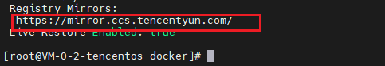

> TencentOS Server 4 for x86_64系统的docker需要下载docker镜像,有些镜像下载缓慢,可以尝试配置腾讯云提供的镜像源进行下载

# 一.新增配置文件

```shell
# 新增目录
mkdir /etc/docker

# 创建配置文件
vim /etc/docker/daemon.json
```

> 配置文件内容

```json
{
    "registry-mirrors": [
        "https://mirror.ccs.tencentyun.com"
    ]
}
```

# 二. 重启docker

```shell
sudo systemctl restart docker
```

# 三. 验证镜像源配置是否成功

```shell
sudo docker info
```

> 打印这个配置即为成功


