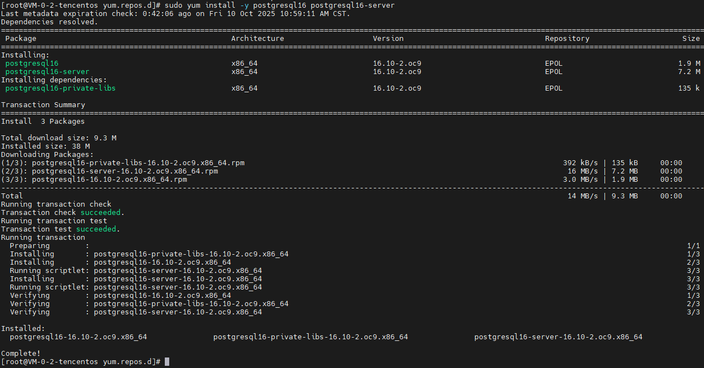
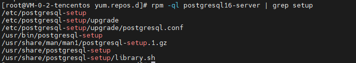
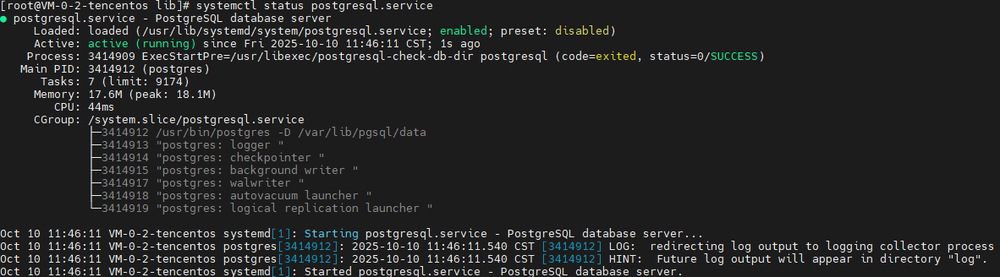
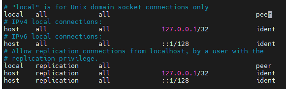
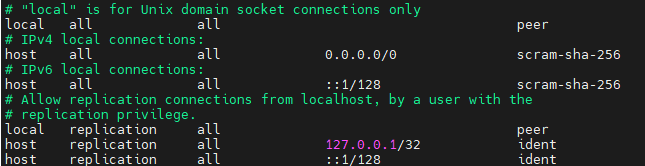

# 一、更新查询yum源

## 清理缓存

```yaml
sudo yum clean all
```

## 生成最新缓存

```yaml
sudo yum makecache
```

## 更新所有软件包

```yaml
sudo yum update
```

## 查看可用 PostgreSQL 版本

```shell
yum list available | grep postgres
```

# 二、安装核心包

## 安装源

```shell
sudo yum install -y postgresql16 postgresql16-server postgresql16-contrib
```



## 使用命令查找安装脚本目录

```shell
rpm -ql postgresql16-server | grep setup
```



## 初始化数据库

```shell
sudo /usr/bin/postgresql-setup --initdb
```


## 设置开机自启动

```shell
sudo systemctl enable --now postgresql
```


## 查询数据库状态

```shell
sudo systemctl status postgresql
```



# 三、配置数据库配置项

## 1. 设置初始化密码

### 切换到 PostgreSQL 用户

```shell
sudo -i -u postgres
```

### 使用 psql 设置初始化密码

```shell
# 进入 PostgreSQL 命令行：
psql

# 在 psql 提示符下设置密码，例如把密码设为 MySecurePassword123  wsznCm&Y?fA:>MfV
ALTER USER postgres WITH PASSWORD 'MySecurePassword123  ';
```

## 2. 修改连接方式和端口

### 切换到 PostgreSQL 用户

```shell
sudo -i -u postgres
```

### 查找配置文件目录

```shell
psql -c "SHOW hba_file;"
```

### 初始化的pg_hba.conf



### 修改配置文件



## 3. 服务器验证是否正常

### 退出当前账号

Ctrl + D

### 重启服务

```shell
sudo systemctl restart postgresql
```

### 测试账号是否正常

```shell
# 切换用户
sudo -i -u postgres

# 登录
psql -U postgres -h localhost -W
# 输入重置密码
xxxx
```

## 4. 远程连接测试正常

### 修改配置文件

```shell
sudo vim /var/lib/pgsql/data/postgresql.conf
```

```shell
# 监听端口
# listen_addresses = 'localhost'

改为

listen_addresses = '*'

# 数据库端口
# port = 5432

改为

port = 4320

```

> tip：修改端口后，不能直接使用psql连接（会有连接socket文件找不到异常"/var/run/postgresql/.s.PGSQL.5432" failed: No such file or directory
），需要使用 psql -p 4320

### 重启服务

```shell
sudo systemctl restart postgresql
```

# 四、新建用户和权限分配

## 新建数据库用户

```shell
CREATE USER xiaozhi WITH PASSWORD 'd[j%dbKCY]xV)|>t';
```

## 新建数据库

```shell
CREATE DATABASE xiaozhi_mcphub OWNER xiaozhi;
```

## 收紧权限

```shell
REVOKE CONNECT ON DATABASE postgres FROM PUBLIC;

REVOKE CONNECT ON DATABASE xiaozhi_mcphub FROM PUBLIC;
```

## 只允许用户访问自己数据库（可不操作）

```shell
GRANT CONNECT ON DATABASE xiaozhi_mcphub TO xiaozhi;

REVOKE ALL ON SCHEMA public FROM PUBLIC;

GRANT ALL ON SCHEMA public TO xiaozhi;
```

## 修改密码

```shell
ALTER USER xiaozhi PASSWORD '.GbGCTPvhA*H6zj8';
```
