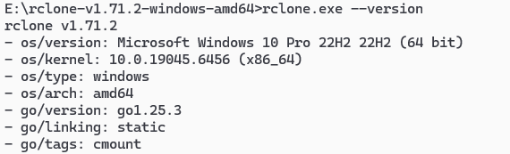

> 接手了一个系统,是阿里云oss做文件存储服务的,公司目前云资源都在腾讯云上,不考虑申请阿里云oss,打算申请腾讯cos,需要实现文件服务迁移.

# 一、实现思路

### 1. Rclone迁移文件

通过rclone软件进行迁移oss文件至cos中

### 2. 修改数据库文件相关表的链接

通过sql修改数据库文件相关字段的阿里云oss域名，替换为cos域名

# 二、具体实现

## 1. Rclone迁移文件

### 1. 安装 rclone

- 官网：[rclone官网](https://rclone.org/)
- Linux/macOS/Windows 均支持。
    - 例如在 Linux 上：



### 2. 获取阿里云或腾讯云的访问密钥

[阿里云-访问密钥](https://ram.console.aliyun.com/manage/ak) 

[腾讯云-访问密钥](https://console.cloud.tencent.com/cam/capi)

### 3. 配置 rclone 远程存储（Remotes）

> 运行以下命令配置两个远程存储

```shell
rclone config
```

1. **添加阿里云 OSS 远程**（例如命名为 `aliyun-oss`）
    - 选择 `n`（新建 remote）
    - Name: `aliyun-oss`
    - Storage type: 输入 `s3`（阿里云 OSS 兼容 S3 协议）
    - provider: 输入 `Alibaba Cloud`
    - env_auth: `false`
    - access_key_id: 你的阿里云 AccessKey ID
    - secret_access_key: 你的阿里云 AccessKey Secret
    - endpoint: 例如 `oss-cn-beijing.aliyuncs.com`（根据你的 Bucket 所在区域填写）
    - location_constraint: 留空或填写区域如 `oss-cn-beijing`
2. **添加腾讯云 COS 远程**（例如命名为 `tencent-cos`）
    - 选择 `n`（新建 remote）
    - Name: `tencent-cos`
    - Storage type: 输入 `s3`
    - provider: 输入 `Other`
    - env_auth: `false`
    - access_key_id: 你的腾讯云 SecretId
    - secret_access_key: 你的腾讯云 SecretKey
    - endpoint: 例如 `cos.ap-beijing.myqcloud.com`（根据你的 COS Bucket 区域填写）
    - location_constraint: 留空或填写区域如 `ap-beijing`
    - acl: 配置 `private` 私有的，配置 `public-read` 公共读
    - 其他选项保持默认

### 4.执行迁移（复制或同步）

**方式 1：复制（保留源文件）**

```shell
rclone copy aliyun-oss:my-oss-bucket tencent-cos:my-cos-bucket \
  --progress \
  --transfers=16 \
  --checkers=32 \
  --s3-upload-concurrency=8 \
  --s3-chunk-size=100M
```

**方式 2：同步（使目标与源完全一致，会删除目标中多余的文件）**

```shell
rclone sync aliyun-oss:my-oss-bucket tencent-cos:my-cos-bucket \
  --progress \
  --transfers=16 \
  --checkers=32 \
  --s3-upload-concurrency=8 \
  --s3-chunk-size=100M \
  --dry-run  # 先试运行，确认无误后去掉此参数
```

> 参数说明

| **参数** | **说明** |
| --- | --- |
| `--progress` | 显示实时进度 |
| `--transfers=N` | 并行传输文件数（默认 4，可提高） |
| `--checkers=N` | 并行检查文件数（默认 8） |
| `--s3-upload-concurrency` | COS/OSS 分块上传并发数 |
| `--s3-chunk-size` | 分块大小（大文件建议 100M） |
| `--exclude` / `--include` | 过滤文件 |
| `--log-file=xxx.log` | 记录日志 |
| `--stats=10s` | 每 10 秒输出一次统计 |

### 5. 迁移大文件或海量文件的建议

- 使用 `screen` 或 `tmux`：防止 SSH 断开导致中断
- **分目录迁移**：如果桶内目录结构复杂，可分批迁移

```shell
rclone copy aliyun-oss:my-oss-bucket/folder1 tencent-cos:my-cos-bucket/folder1
```

- **监控网络和带宽**：跨云迁移可能受公网带宽限制
- **考虑使用内网（如 ECS + CVM 同区域）**：若在阿里云 ECS 上运行 rclone，并配置 COS 内网 endpoint（如 `cos-internal.ap-beijing.tencentcos.cn`），可节省流量费用并提速

### 6. 验证迁移结果

迁移完成后，可对比文件数量和大小：

```shell
rclone size aliyun-oss:my-oss-bucket

rclone size tencent-cos:my-cos-bucket
```

或使用校验（如果文件不多）：

```shell
rclone check aliyun-oss:my-oss-bucket tencent-cos:my-cos-bucket
```
