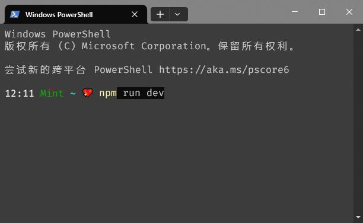

> 使用Windows Terminal浅色背景时,输入空格背景会变深色



## PSReadline

> PSReadline 是一个用于增强 PowerShell 控制台体验的模块，主要提供命令行编辑、历史记录搜索、自动完成以及命令行高亮显示等功能。它提供了类似 Unix Shell 的命令行增强功能。

但是 Windows Terminal 最近更新的版本 1.21.10351.0 以及之后的版本估计添加了新的特性，导致老版本的 PSReadline 不兼容。

## 解决方法

> 把 PSReadline 更新到最新版即可。

查看当前 PSReadline 版本

```shell
Get-Module -ListAvailable PSReadline
```

如果显示版本为 2.0.0 那么就需要更新了。

**安装或更新（需要管理员身份运行）**

```shell
Install-Module -Name PSReadLine -Scope AllUsers -AllowClobber -Force
#or
Update-Module -Name PSReadline
```

再次重启 Windows Terminal 就可以看到纯色文字背景的问题解决了。
