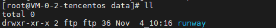
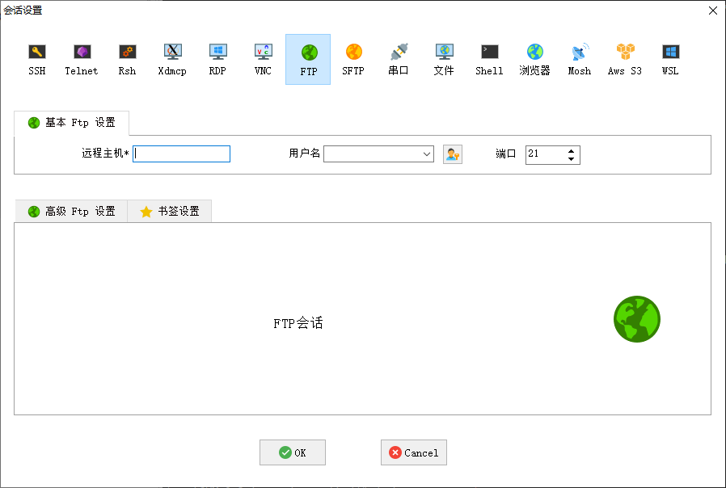

> 对接硬件下载需要使用ftp进行下载固件,进行ftp服务器安装

# 一. 编写docker-compose.yml

## 1. 新建文件

```shell
# 进行安装目录
cd /opt

# 创建目录
mkdir vsftpd

# 创建docker-compose.yml
vim docker-compose.yml
```

### docker-compose.yml

```yaml
services:
  ftp:
    image: fauria/vsftpd
    container_name: vsftpd
    restart: unless-stopped
    ports:
      - "20:20"
      - "21:21"
      - "11901-11903:11901-11903"
    environment:
      - FTP_USER=ftpuser               # 登录用户名
      - FTP_PASS=xxxxxxxxxxxxxxxx      # 登录密码
      - PASV_ADDRESS=xxx.xxx.xx.xx     # 公网IP
      - PASV_MIN_PORT=11901
      - PASV_MAX_PORT=11903
      - LOCAL_UMASK=022
      - REVERSE_LOOKUP_ENABLE=NO
      - LOG_STDOUT=YES
    command: /bin/bash -c "/usr/sbin/run-vsftpd.sh & sleep 3 && touch /var/log/vsftpd.log && tail -F /var/log/vsftpd.log"
    network_mode: bridge
    volumes:
      - ./data:/home/vsftpd         # 本地 data 目录映射到容器中的 FTP 根目录

```

环境变量解析

| key | directions |
| --- | --- |
| FTP_USER | ftp的登录用户名,这种方式只能配置一个用户 |
| FTP_PASS | ftp用户的登录密码 |
| PASV_ADDRESS | 服务器公网IP |
| PASV_MIN_PORT | ftp被动模式端口,分配的最小端口 |
| PASV_MAX_PORT | ftp被动模式端口,分配的最大端口 |
| LOCAL_UMASK | FTP上传文件的默认权限<br>022: 所有人可读，只有所有者可写（常用）<br>002: 所有者和组可写，其他人可读<br>077: 只有所有者可读写，最安全 |
| REVERSE_LOOKUP_ENABLE | NO: 禁用 FTP 客户端 IP 地址的反向 DNS 解析<br>对公网服务器或云主机（如腾讯云、阿里云）来说几乎没意义 |
| LOG_STDOUT | 把 `/var/log/vsftpd.log` 的内容通过 `tail -f` 输出到容器标准输出 |

> 端口20,主动访问端口,在配置了 `PASV_MIN_PORT` 和 `PASV_MAX_PORT` 的时候,开启的是被动端口,20 端口可以不开放.

# 二.启动容器,配置环境

## 1. 启动容器

```shell
docker compose up -d
```

## 2. 配置环境

### 开放防火墙端口

```shell
# 开放21,11901~11902端口
sudo firewall-cmd --zone=public --add-port=20/tcp --permanent

# 使配置生效
sudo firewall-cmd --reload
```

### 如果是云服务器,需要配置安全组

`略`

# 三.验证

### 查询是否创建目录

在 `/opt/vsftpd/data/ftpuser` 上是有新增了目录



ftp连接工具,是否可以正常连接上



### 可以正常连接,说明安装成功

# 四.遇到的问题

## 1.ip端口配置问题

```shell
[root@VM-0-2-tencentos vsftpd]# ftp 43.142.57.253
Connected to 43.142.57.253 (43.142.57.253). 
220 (vsFTPd 3.0.2) 
Name (43.142.57.253:root): runway 
331 
Please specify the password. 
Password: 
230 Login successful. 
Remote system type is UNIX. 
Using binary mode to transfer files. 
ftp> ll ?Invalid command 
ftp> ls 227 Entering Passive Mode (43,142,57,253,46,125). 
ftp: connect: Connection refused 
ftp>
```

### 原因

这个是因为在配置 `docker-compose.yml` 的时候,端口端映射配置异常,直接写了11901:11903,但是 `PASV_MIN_PORT` 和 `PASV_MAX_PORT` 配置还是11901和11903

### 解决方法

修改 `docker-compose.yml` 的端口映射

## 2. 日志不打印问题

:::note
别问为什么不直接映射日志目录,就是犟
:::

### 问题1

在 `docker-compose.yml` 没有配置 `command` 的时候,使用 `docker logs vsftpd` 是没有日志输出的,但是在容器中的 `/var/log/vsftpd.log` 是有正常日志输出的

### 原因

这个是因为**启动脚本没有真正执行日志转发命令**（`tail -F /var/log/vsftpd.log`）。

### 解决思路

在 `docker-compose.yml` 中配置启动命令 `command: /bin/bash -c "vsftpd & tail -F /var/log/vsftpd.log"` 重启docker compose

---

### 问题2

```shell
[root@VM-0-2-tencentos vsftpd]# docker logs vsftpd 
tail: cannot open '/var/log/vsftpd.log' for reading: No such file or directory

```

### 原因

在执行 `tail -F /var/log/vsftpd.log` 时，**vsftpd 服务还没来得及创建这个日志文件**

### 解决思路

加一个等待时间

```shell
command: /bin/bash -c "vsftpd & sleep 3 && touch /var/log/vsftpd.log && tail -F /var/log/vsftpd.log"
```

解释：

- `vsftpd &`：先后台启动 FTP 服务；
- `sleep 3`：等待 3 秒，让 vsftpd 完成初始化；
- `touch /var/log/vsftpd.log`：如果文件不存在则创建；
- `tail -F /var/log/vsftpd.log`：持续输出日志到 Docker stdout。

---

### 问题3

重新启动后,发现用户无法正常登录了

### 原因

因为启动的时候没有正确执行初始化脚本，容器**正常执行启动脚本** `/usr/sbin/run-vsftpd.sh` 时，才会创建用户

### 解决思路

配置初始化脚本

```shell
command: /bin/bash -c "/usr/sbin/run-vsftpd.sh & sleep 3 && tail -F /var/log/vsftpd.log"
```

---

完结

✿✿ヽ(°▽°)ノ✿
