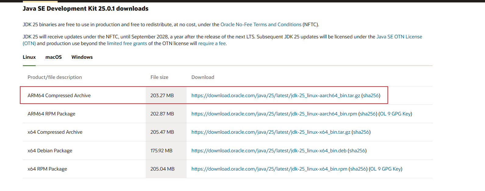
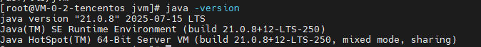

> Linux需要Java环境来运行Java程序,本文介绍如何安装Java环境

# 一、下载jdk

---

在 [Oracle官网](https://www.oracle.com/java/technologies/downloads/) 下载 对应版本的jdk



# 二、上传服务器

---

## 1. 创建文件夹

```shell
mkdir /usr/lib/jvm
```

## 2. 上传并解压

```shell
tar -zxvf jdk-21_linux-x64_bin.tar.gz
```

## 3. 重命名(`可选`)

```shell
mv jdk-21_linux-x64_bin jdk-21
```

# 三、配置环境变量

---

## 1. 编辑文件

```shell
vim /etc/profile
```

### 底部插入内容

```shell
export JAVA_HOME=/usr/lib/jvm/jdk-21
export PATH=$PATH:$JAVA_HOME/bin
```

## 2. 重新加载环境变量

```shell
source /etc/profile
```

# 四、验证

---

## 1. `java -version` 命令输出，校验成功


