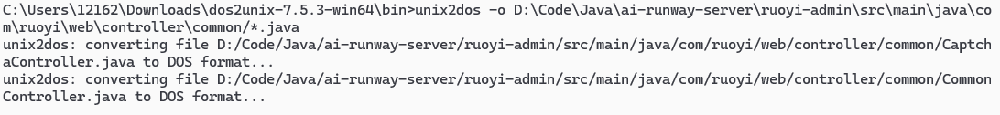
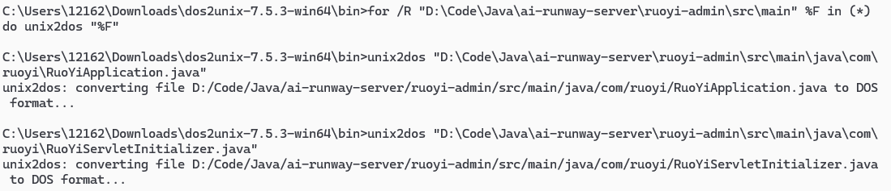

> 通过压缩包更新项目代码的时候,给的代码是LF的,但是在windows上默认是CRLF,需要调整换行分隔符,否则git提交的时候每一个文件都存在更新的

# 一、实现方法

## 1. git忽略换行符

**待尝试..**

## 2. 通过 `unix2dos` 软件进行批量操作

### 下载 `unix2dos` 软件

下载链接：[unix2dos](https://dos2unix.sourceforge.io/dos2unix/zh_CN/man1/dos2unix.htm) 下载对应的文件

---

### 更新单个目录下的指定后缀文件

```shell
unix2dos -o D:\Code\Java\ai-runway-server\ruoyi-admin\src\main\java\com\ruoyi\web\controller\common/*.java
```



---

### 递归更新目录下的所有文件

```shell
for /R "D:\Code\Java\ai-runway-server\ruoyi-wxprogram\src\main" %F in (*) do unix2dos "%F"
```


