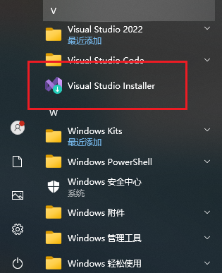
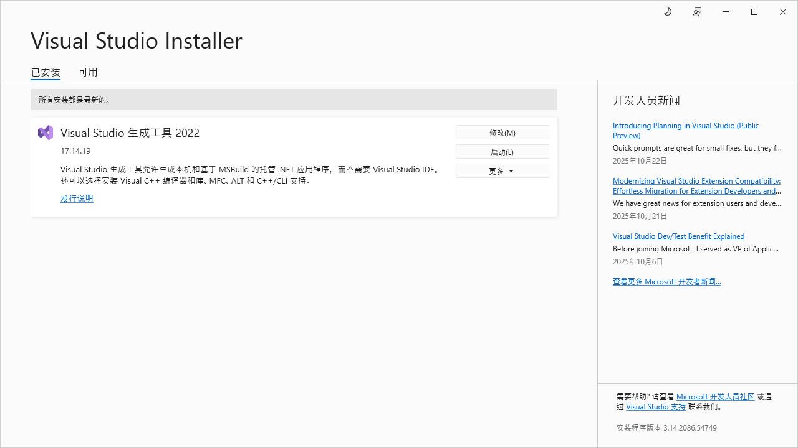
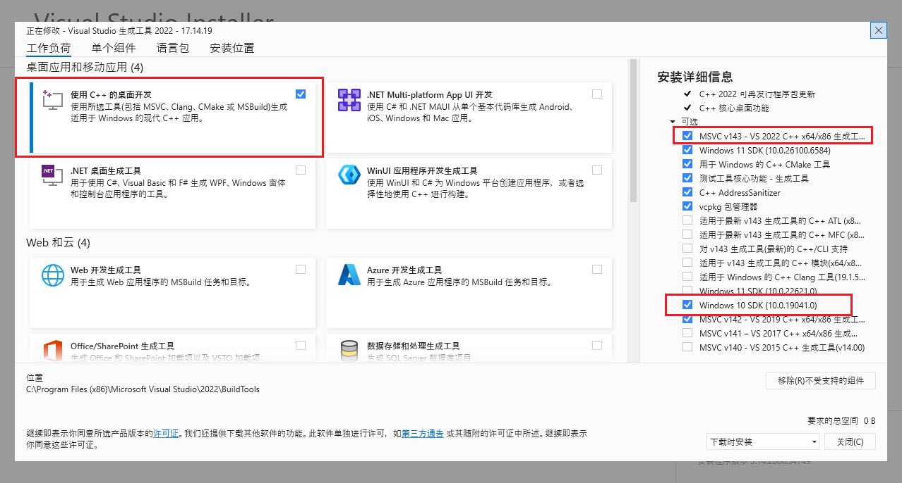

# 一. 在搭建python安装环境的时候,报错系统没有C++环境

## 执行命令

```shell
pip install -r requirements.txt
```

## 报错

```shell
  error: subprocess-exited-with-error

  × Preparing metadata (pyproject.toml) did not run successfully.
  │ exit code: 1
  ╰─> [21 lines of output]                                                                                                                                                                
      + meson setup C:\Users\29171\AppData\Local\Temp\pip-install-gh6k3sf2\scikit-learn_750b40a446ee407e9a212e2ac74d920c C:\Users\29171\AppData\Local\Temp\pip-install-gh6k3sf2\scikit-lea
rn_750b40a446ee407e9a212e2ac74d920c\.mesonpy-giqnqi8z -Dbuildtype=release -Db_ndebug=if-release -Db_vscrt=md --native-file=C:\Users\29171\AppData\Local\Temp\pip-install-gh6k3sf2\scikit-learn_750b40a446ee407e9a212e2ac74d920c\.mesonpy-giqnqi8z\meson-python-native-file.ini
      The Meson build system
      Version: 1.9.1
      Source dir: C:\Users\29171\AppData\Local\Temp\pip-install-gh6k3sf2\scikit-learn_750b40a446ee407e9a212e2ac74d920c
      Build dir: C:\Users\29171\AppData\Local\Temp\pip-install-gh6k3sf2\scikit-learn_750b40a446ee407e9a212e2ac74d920c\.mesonpy-giqnqi8z
      Build type: native build
      WARNING: Failed to activate VS environment: Could not parse vswhere.exe output
      Project name: scikit-learn
      Project version: 1.5.1

      ..\meson.build:1:0: ERROR: Unknown compiler(s): [['icl'], ['cl'], ['cc'], ['gcc'], ['clang'], ['clang-cl'], ['pgcc']]
      The following exception(s) were encountered:
      Running `icl ""` gave "[WinError 2] 系统找不到指定的文件。"
      Running `cl /?` gave "[WinError 2] 系统找不到指定的文件。"
      Running `cc --version` gave "[WinError 2] 系统找不到指定的文件。"
      Running `gcc --version` gave "[WinError 2] 系统找不到指定的文件。"
      Running `clang --version` gave "[WinError 2] 系统找不到指定的文件。"
      Running `clang-cl /?` gave "[WinError 2] 系统找不到指定的文件。"
      Running `pgcc --version` gave "[WinError 2] 系统找不到指定的文件。"

      A full log can be found at C:\Users\29171\AppData\Local\Temp\pip-install-gh6k3sf2\scikit-learn_750b40a446ee407e9a212e2ac74d920c\.mesonpy-giqnqi8z\meson-logs\meson-log.txt
      [end of output]                                                                                                                                                                     

  note: This error originates from a subprocess, and is likely not a problem with pip.
error: metadata-generation-failed

× Encountered error while generating package metadata.
╰─> scikit_learn

note: This is an issue with the package mentioned above, not pip.
hint: See above for details.
```

# 二.问题原因

因为**系统没有可用的 C/C++ 编译器**，而 `scikit-learn` 在安装时需要编译部分 C 扩展（即 `.c` 或 `.cpp` 源码）。

### 主要问题

```shell
ERROR: Unknown compiler(s): [['icl'], ['cl'], ['cc'], ['gcc'], ['clang'], ['clang-cl'], ['pgcc']]
Running `cl /?` gave "[WinError 2] 系统找不到指定的文件。"

```

# 三.解决方法

### 安装C++环境

1. 通过 [`build-tools`](https://visualstudio.microsoft.com/zh-hans/visual-cpp-build-tools/) 下载 `vs_BuildTools.exe` 进行安装
2. 打开 `软件` 





3. 点击修改,新增环境,进行安装



### 编写加载环境变量脚本

4. 脚本内容

```shell
@echo off
chcp 65001 >nul
rem ====================================================
rem 作用：在当前 CMD 窗口中加载 Visual Studio 2022 Build Tools 编译环境
rem ====================================================

set "VSCOMNTOOLS=C:\Program Files (x86)\Microsoft Visual Studio\2022\BuildTools\VC\Auxiliary\Build"

if not exist "%VSCOMNTOOLS%\vcvars64.bat" (
    echo [ERROR] 未找到 vcvars64.bat，请检查 Visual Studio Build Tools 是否安装。
    pause
    exit /b 1
)

call "%VSCOMNTOOLS%\vcvars64.bat"

echo.
echo ✅ MSVC 环境已成功加载！
echo 现在可以在此窗口中运行 cl、pip install numpy 等命令。
echo.

cmd /k

```

5. 重命名 `activate-msvc.bat`
6. 把这个文件配置环境变量
7. 在执行 `pip install -r requirements.txt` 的前执行 `activate-msvc.bat` .
